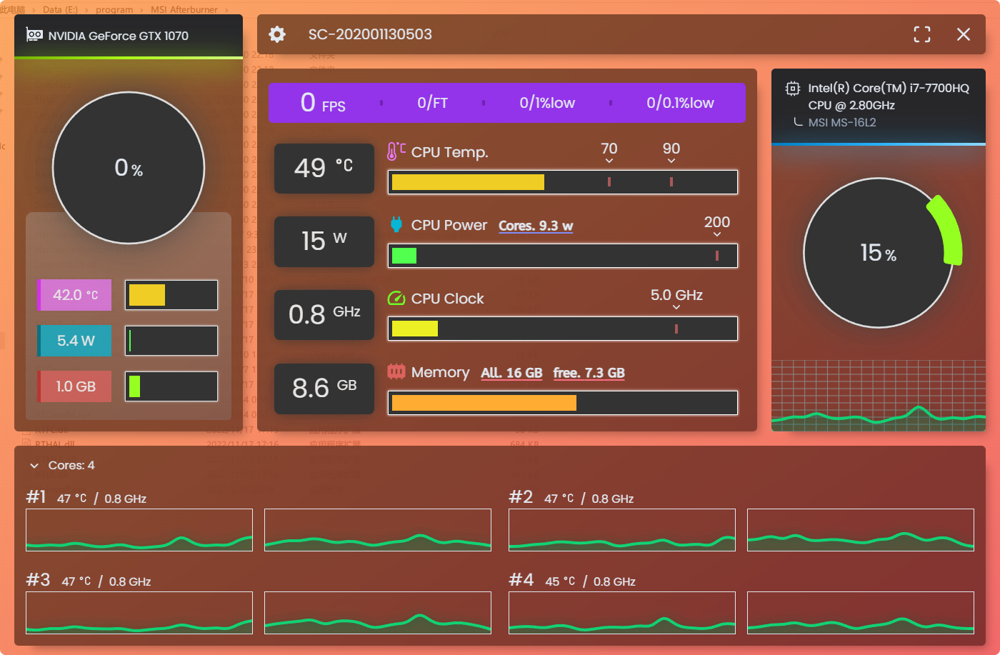

# Headless System Monitor

A cross platform pretty system monitor focus on provide efficient and clear ui.
Can also using data from self or variable sources.





## Recommended IDE Setup

- [VS Code](https://code.visualstudio.com/) + [Tauri](https://marketplace.visualstudio.com/items?itemName=tauri-apps.tauri-vscode) + [rust-analyzer](https://marketplace.visualstudio.com/items?itemName=rust-lang.rust-analyzer)

## development

```bash
npx tauri dev
&
yarn tauri dev
```

## Data sources

1. [LibreHardwareMonitor](https://github.com/LibreHardwareMonitor/LibreHardwareMonitor)
2. [Msi Afterburner](https://www.msi.com/Landing/afterburner/graphics-cards)

# License
MIT
